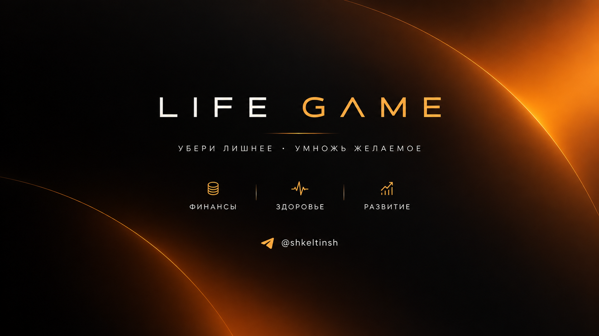

<!-- docs/agent.md — Version 1.8 -->

# LifeGame — Agent Rules

## 1. Чистая архитектура

Первостепенное правило проекта — соблюдать принцип **Clean Architecture (Чистая архитектура)**.

Бизнес-логика и правила предметной области должны быть изолированы от технических деталей, инфраструктуры, UI, платформ и способов хранения данных.

При разработке новых функций необходимо в первую очередь определить, к какому архитектурному слою относится ответственность, и не допускать нарушения границ между слоями.

## 2. Один файл = одна ответственность

Каждый файл проекта должен иметь **одну чётко определённую ответственность**.

Не следует объединять в одном файле:
- несколько независимых бизнес-задач;
- разные архитектурные слои;
- UI, бизнес-логику и инфраструктурный код;
- несвязанные функции только ради сокращения количества файлов.

Если ответственность становится слишком большой или неоднозначной — её необходимо разделить на отдельные модули.

## 3. Строчные имена файлов и папок

Все новые и изменяемые **папки и файлы проекта должны называться со строчной буквы**.

Правила:
- первая буква имени файла — строчная;
- первая буква имени папки — строчная;
- не создавать новые имена с заглавной первой буквой;
- при создании вложенных директорий это правило применяется на каждом уровне;
- имена должны оставаться единообразными во всём проекте.

Примеры:

Правильно:
- `docs`
- `changes`
- `finance.js`
- `agent.md`
- `user.memory.js`

Неправильно:
- `Docs`
- `Changes`
- `Finance.js`
- `Agent.md`

Это правило относится ко всем новым файлам и папкам, которые мы создаём, сохраняем или редактируем в рамках проекта.

## 4. Версионирование каждого изменения файла

При **каждом создании, изменении или редактировании файла** в самом начале его кода должна быть указана текущая версия изменения.

Формат:

`finance.js — Version 1.0`

При следующем изменении:

`finance.js — Version 1.1`

Далее версия увеличивается последовательно:

`1.2`, `1.3`, `1.4` и т.д.

Правила:
- версия относится непосредственно к конкретному файлу;
- при первом создании файла используется `1.0`;
- каждое последующее изменение этого файла увеличивает номер версии на `0.1`;
- строка версии должна находиться **в самом начале кода файла**;
- версия должна обновляться при любом изменении содержимого файла, даже если изменение небольшое.

Для файлов, где синтаксис не поддерживает обычный комментарий в первой строке, используется первый допустимый для данного формата способ указать версию.

## 5. Журнал изменений

В папке:

`docs/changes/`

после **каждого изменения проекта** должен создаваться отдельный файл с описанием выполненной работы.

Каждый Change-файл должен содержать:
- дату и точное время изменения;
- изменённые файлы;
- версии файлов до и после изменения;
- что именно было изменено;
- причину изменения;
- важные архитектурные решения, если они были приняты;
- итоговый статус изменения.

Название Change-файла также должно быть написано со строчной буквы и однозначно содержать дату/время или последовательный идентификатор.

### Структура Change-файлов по датам

Все Change-файлы должны храниться в подпапках `docs/changes/`, разделённых по календарным дням.

Формат папки:
`docs/changes/D.M.YYYY/`

Правила:
- для каждого календарного дня создаётся отдельная папка с датой этого дня;
- все изменения, выполненные в течение одного дня, помещаются в соответствующую папку;
- при наступлении следующего календарного дня создаётся новая папка с новой датой;
- Change-файлы одного дня не должны находиться непосредственно в `docs/changes/` или в папке другого дня;
- дата папки определяется по московскому времени (MSK, UTC+03:00), установленному для Change-файлов;
- имя папки записывается в формате `D.M.YYYY` без ведущих нулей, например `changes/1.10.2026/`.

Пример:

```text
docs/changes/
├── 1.10.2026/
│   ├── 06-53-29.md
│   ├── 07-15-10.md
│   └── ...
├── 2.10.2026/
│   ├── 09-10-00.md
│   └── ...
└── ...
```

### Часовой пояс Change-файлов

**Все файлы в `docs/changes/` должны содержать дату и время, указанные по часовому поясу России — Москва (MSK, UTC+03:00).**

Правила:
- дата и время в содержимом Change-файла указываются по московскому времени;
- московское время является обязательным независимо от часового пояса среды, устройства пользователя или GitHub;
- в Change-файле необходимо явно указывать `MSK (UTC+03:00)`;
- если дата и время используются в имени Change-файла, они также должны соответствовать московскому времени.

### Язык Change-файлов

**Каждый новый файл в `docs/changes/` должен быть написан полностью на русском языке.**

При этом русскоязычное оформление не должно сокращать или исключать информацию: Change-файл обязан содержать **всю информацию об изменении**, предусмотренную этим документом, включая дату и точное время, изменённые файлы, версии до и после изменения, описание изменений, причину, архитектурные решения и итоговый статус.

Допускается использовать технические термины, названия файлов, классов, функций, директорий, команд, технологий и другие идентификаторы в их оригинальном написании.

Журнал изменений является частью документации проекта и используется для восстановления контекста, аудита и продолжения разработки.

## 6. Двухэтапный процесс разработки

Любой запрос пользователя, который предполагает **изменение репозитория**, должен проходить два отдельных этапа.

### Этап 1 — Обсуждение и согласование

До внесения изменений в GitHub необходимо:

1. понять, что именно требуется изменить;
2. проверить применимые правила и архитектуру проекта;
3. определить затрагиваемые файлы и архитектурные слои;
4. выявить неоднозначности и задать необходимые уточняющие вопросы;
5. если существует несколько разумных вариантов реализации — представить их пользователю;
6. кратко описать последствия и архитектурные особенности вариантов;
7. получить явное решение пользователя о выбранном варианте.

**На этом этапе изменения в репозиторий не вносятся.**

### Этап 2 — Реализация

После явного подтверждения пользователя выбранного решения необходимо:

1. проверить актуальное состояние репозитория;
2. повторно свериться с `docs/agent.md`;
3. реализовать согласованный вариант;
4. изменить только необходимые файлы;
5. соблюдать Clean Architecture, DDD и принцип «один файл = одна ответственность»;
6. обновить версии всех изменённых файлов;
7. создать запись в `docs/changes/`;
8. проверить имена новых и изменённых файлов и папок;
9. зафиксировать результат в Git;
10. сообщить пользователю, что именно было изменено, какие файлы затронуты и каким commit это зафиксировано.

### Исключение

Если пользователь явно просит выполнить конкретное изменение **без предварительного обсуждения**, реализация может быть выполнена сразу.

При этом правила архитектуры, версионирования, lowercase naming и Change Log остаются обязательными.

## 7. Единая система дизайна

**`design` — это не один огромный `design.js`, а Design System из маленьких независимых модулей. Каждый файл отвечает только за одну категорию визуальных правил.**

Design System является единым источником визуальных правил приложения и должен обеспечивать единый дизайн во всех доменах и интерфейсах LifeGame.

### 7.1. Технология Design System

Для веб-версии LifeGame визуальный слой Design System реализуется на **CSS**.

JavaScript не является частью `source/design` и не используется для хранения визуальных правил.

JavaScript может использоваться в UI/Application-слое только для поведения интерфейса, например для переключения темы через атрибут `data-theme`, но не для дублирования CSS-правил.

### 7.2. Утверждённая структура `source/design`

Структура Design System является фиксированной архитектурной основой:

```
source/
└── design/
    │
    ├── tokens/
    │   ├── colors.css
    │   ├── typography.css
    │   ├── spacing.css
    │   ├── radius.css
    │   ├── shadows.css
    │   ├── borders.css
    │   ├── gradients.css
    │   └── motion.css
    │
    ├── foundation/
    │   ├── reset.css
    │   ├── base.css
    │   ├── layout.css
    │   └── accessibility.css
    │
    ├── components/
    │   ├── button.css
    │   ├── card.css
    │   ├── input.css
    │   ├── modal.css
    │   ├── accordion.css
    │   ├── navigation.css
    │   ├── header.css
    │   ├── list.css
    │   ├── badge.css
    │   └── progress.css
    │
    ├── patterns/
    │   ├── dashboard.css
    │   ├── forms.css
    │   └── statistics.css
    │
    ├── themes/
    │   ├── dark.css
    │   └── light.css
    │
    └── design.css
```

### 7.3. Ответственность каталогов

`tokens/` — атомарные визуальные значения Design System: цвета, типографика, интервалы, радиусы, тени, границы, градиенты и motion-правила.

`foundation/` — базовые правила интерфейса: reset, глобальные стили, базовая типографика, layout и accessibility.

`components/` — переиспользуемые UI-компоненты. Каждый файл отвечает за внешний вид одной категории компонента.

`patterns/` — составные визуальные паттерны, построенные из Design System components. Они не содержат бизнес-логику.

`themes/` — визуальные темы приложения. Темы переопределяют Design Tokens через CSS Custom Properties.

`design.css` — единая точка входа Design System. Файл подключает модули Design System и не должен превращаться в монолитный файл со всеми стилями.

### 7.4. Архитектурные ограничения Design System

Не создавать внутри `source/design`:
- `design.js`;
- `theme.js`;
- `colors.js`;
- JS-файлы визуальных компонентов;
- бизнес-логику;
- расчёты Finance, Health, Development или других доменов;
- прямые зависимости от `domain`, `memory` или `infrastructure`.

Не создавать отдельные доменные стили вида `finance.css`, `health.css` или `development.css` внутри Design System без отдельного архитектурного согласования. Домены используют общую Design System.

Design System должна оставаться независимой от бизнес-доменов.

Принцип направления зависимостей:

`Domain → UI → Design System → Design Tokens`

Обратная зависимость `Design System → Domain` запрещена.

При создании новых элементов интерфейса необходимо сначала проверить, существует ли соответствующий компонент или токен в Design System. Если существует — его необходимо переиспользовать, а не создавать отдельную локальную реализацию.

## Правило для дальнейшей разработки

Перед созданием или изменением кода необходимо сверяться с этим документом.

Если предлагаемое решение нарушает эти правила, архитектура должна быть пересмотрена до написания кода.

После каждого изменения необходимо:
1. проверить имена новых и изменяемых файлов и папок;
2. обновить версию изменённого файла;
3. создать запись в `docs/changes/`;
4. указать дату и точное время;
5. зафиксировать результат изменения в Git.


## 8. Утверждённый визуальный референс интерфейса

Ниже закреплён визуальный референс, на основе которого далее разрабатывается интерфейс LifeGame:



Этот референс является исходной точкой для визуального слоя проекта.

### 8.1. Основные визуальные принципы

При дальнейшей разработке необходимо сохранять следующие характеристики референса:

- преимущественно чёрный фон и тёмная визуальная среда;
- минималистичная композиция без визуального шума;
- высокий контраст между основным текстом и второстепенной информацией;
- крупная, выразительная типографика для названий модулей;
- небольшие uppercase-метки для системной информации;
- тонкие светлые границы и мягкие скругления карточек;
- сдержанные градиенты, глубина и мягкие свечения без перегрузки интерфейса;
- ощущение премиального системного интерфейса;
- модульная структура экрана;
- нижняя навигация с чётким выделением активного модуля;
- визуальное разделение основной информации, системного статуса и навигации;
- единый визуальный язык для Finance, Health и Development.

### 8.2. Статус референса

Референс **утверждён как текущая визуальная база проекта**, но не является неизменяемым макетом.

В процессе разработки отдельные параметры — цвета, размеры, интервалы, типографика, радиусы, эффекты и композиция — могут быть изменены только при необходимости и после согласования.

При расхождении между существующим кодом Design System и этим референсом сначала необходимо определить, является ли расхождение сознательным архитектурным решением или незапланированным отклонением.

Не копировать визуальные значения непосредственно в доменные файлы. Все повторно используемые визуальные параметры должны находиться в `source/design` в соответствии со структурой Design System.

## 9. Поведение подблоков и строк

Каждый подблок любого создаваемого раздела LifeGame, включая Finance, Health, Development и Profile, должен поддерживать единый базовый UX-контракт:

1. **Скрытие и раскрытие** — содержимое подблока должно скрываться и раскрываться нажатием на сам подблок.
2. **Редактирование строки** — если строка поддерживает редактирование, режим редактирования должен открываться продолжительным нажатием на строку подблока (long press).
3. **Удаление строки** — удаление строки должно выполняться свайпом влево по строке по паттерну iOS 26.

Эти правила являются частью единого UX-контракта приложения и должны применяться последовательно во всех доменах.

Архитектурное ограничение:
- состояние раскрытия, распознавание long press, жест свайпа и визуальная анимация относятся к UI/Application-слою;
- Domain не должен зависеть от DOM, CSS, жестов, таймеров интерфейса или платформенных API;
- Domain предоставляет операции и события предметной области, которые UI/Application вызывает в ответ на пользовательские действия;
- визуальная реализация должна использовать общий source/design, а не отдельную доменную стилизацию.
